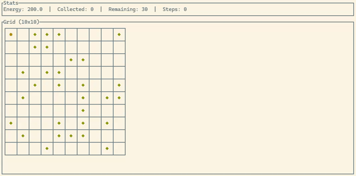

# Description

This example is an implementation of the one described in the book [Complexity A Guided Tour](https://academic.oup.com/book/51004).
It introduces a simple cleaning robot tasked to pick up objects to clean a 2D grid.

The grid's tiles can either be empty, a wall, or contain an object. The robot will always start at the position (0, 0)
on the grid and will pick one of the following action:

- move North,
- move East,
- move South,
- move West,
- move in a random direction,
- pick up,
- idle.

The chosen action is determined by the neighbors' state of the robot, i.e. what's on the tiles North, East, South, West
as well as the current position. All those possible situations and their associated action define the strategy/genome
of the robot. Of course, initially, the actions are randomly chosen for the first generation of the robots population
and the next generations are evolved from that.

To guide the evolution, the robots are evaluated to determine their fitness score with the following criteria:

- they are rewarded for picking up an object,
- they are penalized for hitting a wall, trying to pick up an object on an empty tile or idling

# Running the example

Running the example without building in release mode may be slow.



# Help

```
$ cargo run --release -- -h

Usage: cleaning_robot <COMMAND>

Commands:
  run    Run the genetic algorithm to evolve the best robot
  watch  Watch how a previously evolved & saved robot cleans up a grid
  help   Print this message or the help of the given subcommand(s)

Options:
  -h, --help  Print help
```

## `run` command

```
$ cargo run --release -- run -h

Run the genetic algorithm to evolve the best robot

Usage: cleaning_robot run [OPTIONS]

Options:
      --width <WIDTH>                    The width of the grid [default: 10]
      --height <HEIGHT>                  The height of the grid [default: 10]
      --wall-prob <WALL_PROB>            The probability a tile is a wall [default: 0.0]
      --obj-prob <OBJ_PROB>              The probability a tile contains an object [default: 0.5]
      --pop-size <POP_SIZE>              The robot population size [default: 200]
      --generations <GENERATIONS>        The number of generations to evolve [default: 1000]
      --eval-runs <EVAL_RUNS>            The number of simulations to run to evaluate a robot [default: 100]
      --tournament <TOURNAMENT>          The tournament size for selection [default: 5]
      --mutation <MUTATION>              The mutation rate [default: 0.02]
      --elite <ELITE>                    The number of elite individual to keep for the next generation (must be less than the population size) [default: 10]
      --energy <ENERGY>                  The initial energy of a robot [default: 200.0]
      --obj-reward <OBJ_REWARD>          The reward to give for picking up an object [default: 10.0]
      --energy-reward <ENERGY_REWARD>    The reward to give if a robot has any energy remaining [default: 1.0]
      --wall-penalty <WALL_PENALTY>      The penalty to give for hitting a wall [default: 5.0]
      --pickup-penalty <PICKUP_PENALTY>  The penalty for failing to pick up an object [default: 1.0]
      --idle-penalty <IDLE_PENALTY>      The penalty for idling [default: 0.0]
      --output <OUTPUT>                  The file full path to save the best robot [default: best.json]
      --seed <SEED>                      The seed for the RNG for reproducible executions (optional)
  -h, --help                             Print help
```

## `watch` command

```
$ cargo run --release -- watch -h

Watch how a previously evolved & saved robot cleans up a grid. Press 'Space' to execute a single step, 'a' to execute
steps automatically and 'q' to quit

Usage: cleaning_robot watch [OPTIONS] --input <INPUT>

Options:
      --input <INPUT>          The file full path of a saved robot to watch
      --width <WIDTH>          The width of the grid [default: 10]
      --height <HEIGHT>        The height of the grid [default: 10]
      --wall-prob <WALL_PROB>  The probability a tile is a wall [default: 0.0]
      --obj-prob <OBJ_PROB>    The probability a tile contains an object [default: 0.5]
      --energy <ENERGY>        The initial energy of a robot [default: 200.0]
      --seed <SEED>            The seed for the RNG for reproducible executions (optional)
  -h, --help                   Print help
```