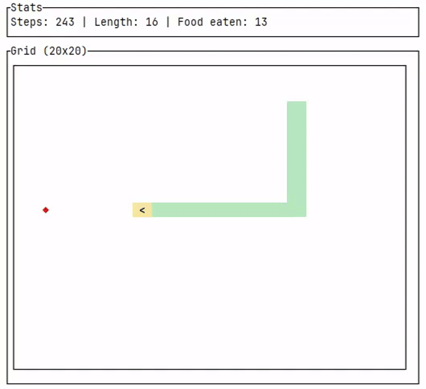

# Description

Snake implementation where the genome is represented by the weights of a (11, 16, 3) feedforward neural network.

The inputs fed to the network are:

- the normalized Manhattan distance between the head of the snake and the food
- the dangerous position next to the current heading (i.e. body or wall straight ahead, left or right)
- the general direction of the food relative to the head position (i.e. left, right, up or down)
- the general direction of the tail of the snake relative to the head position (i.e. left, right, up or down)
- the current direction

# Running the example

Running the example without building in release mode may be slow.



# Help

```
$ cargo run --release -- -h

Usage: snek <COMMAND>

Commands:
  run    Run the genetic algorithm
  watch  Watch a trained genome play
  help   Print this message or the help of the given subcommand(s)

Options:
  -h, --help  Print help
```

## `run` command

```
$ cargo run --release -- run -h

Run the genetic algorithm

Usage: snek run [OPTIONS]

Options:
      --width <WIDTH>                          The width of the grid [default: 20]
      --height <HEIGHT>                        The height of the grid [default: 20]
      --max-steps <MAX_STEPS>                  The maximum of simulation steps allowed [default: 500]
      --eval-runs <EVAL_RUNS>                  The number of simulations to run to evaluate a snake [default: 5]
      --pop-size <POP_SIZE>                    The snake population size [default: 200]
      --generations <GENERATIONS>              The number of generations to evolve [default: 1000]
      --tournament <TOURNAMENT>                The tournament size for selection [default: 5]
      --mutation-rate <MUTATION_RATE>          The mutation rate [default: 0.05]
      --mutation-strength <MUTATION_STRENGTH>  The mutation strength [default: 0.2]
      --elite <ELITE>                          The number of elite individual to keep for the next generation (must be less than the population size) [default: 10]
      --seed <SEED>                            The seed for the RNG for reproducible executions (optional)
      --output <OUTPUT>                        The file full path to save the best snake [default: best.json]
  -h, --help                                   Print help
```

## `watch` command

```
$ cargo run --release -- watch -h

Watch a trained genome play

Usage: snek watch [OPTIONS] --genome <GENOME>

Options:
      --genome <GENOME>        The file full path of a saved snake to watch
      --width <WIDTH>          The width of the grid [default: 20]
      --height <HEIGHT>        The height of the grid [default: 20]
      --max-steps <MAX_STEPS>  The maximum of simulation steps allowed [default: 500]
      --seed <SEED>            The seed for the RNG for reproducible executions (optional)
  -h, --help                   Print help
```
